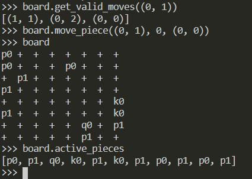

## NotChess

NotChess is a Python board game consiting of two phases:

1. Drafting Phase
2. "Chess" Phase

And can be played by Two or more players.

For more than two players, `board_size` is recommended to be set >= 12 and `pool_size` >= 20, and `pool_size` should be divisible by number of players for fair gameplay.

This Project will be used for Multi-agent Reinforcement Learning Algorithms.
The nature of the game requires a good sense of long term planning in order to win consistently.

NOTE: This game will not have any GUI support, and is meant only to be played by machine agents.

### Drafting Phase
A random chess board state is generated with specified `board_size`, with `pool_size` number of chess pieces in the board.
Currently only Five types of pieces are generated with varying probabilities of being sampled.

1. Firstly, A board is generated.
2. Players take turn choosing which pieces they want to keep as their own.

### "Chess" Phase

This phase of a NotChess game is almost exactly same as the classic Chess, except that there can be more than two players.
The last player with at least one piece left wins.

### Collaborations
Open for Collaborations. Hit me up on `surya.oju@gmail.com`, open an Issue, or just connect with me on ['LinkedIn'](https://www.linkedin.com/in/surya-kant-oju/ "Surya Kant Sahu's LinkedIn")

### Author
Surya Kant Sahu
